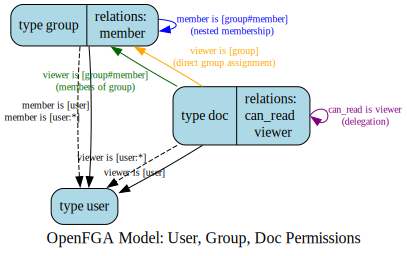

## OpenFGA Model Description for documents.

This OpenFGA model defines a simple authorization system for accessing documents (`doc`) based on users (`user`) and groups (`group`).

This is not a comprehensive setup that cover all possible corner cases, but
it does provide a good basis to build upon. The most notable missing functionalities are:

1. [Blocklists](https://openfga.dev/docs/modeling/blocklists) - When you can forbid groups or individuals to access a document even though they would have read access (either directly or through groups).
2. [Conditions](https://openfga.dev/docs/modeling/conditions) - Access with conditions, like granting access temporarily to something.
3. Document collections - When instead of giving access to every single document to a user you group them in _collections_ and grant access to the collection instead (similar to a gDrive folder in concept).

**Key Components:**

1.  **`type user`**:

    - This is a fundamental type representing individual users in the system. It has no specific relations defined on it directly in this part of the model, meaning users are primarily identified and used in relations of other types.

2.  **`type group`**:

    - This type represents a collection of users, or even other groups.
    - It has one defined relation:
      - **`member`**: This relation determines who is a member of a group.
        - `[user]`: A specific user can be a direct member of a group (e.g., `user:alice` is a `member` of `group:engineering`).
        - `[user:*]`: A wildcard user can be assigned. This means "all users" can be members of a particular group (e.g., `user:*` are `member`s of `group:public`). This is often used for public access.
        - `[group#member]`: This is the crucial part for **nested groups**. It means that the members of another group can be considered members of this group. For example, if `group:frontend_devs` has `group:all_devs#member` as an assignee, then any user who is a `member` of `group:all_devs` is implicitly also a `member` of `group:frontend_devs`. This is a "userset rewrite."

3.  **`type doc`**:
    - This type represents documents, which are the resources being protected.
    - It has two defined relations:
      - **`can_read`**: This defines the permission to read a document. Its definition is simply `viewer`. This means that any user/entity that is a `viewer` of the document `can_read` the document. This is a direct delegation.
      - **`viewer`**: This relation defines who or what entities are considered "viewers" of a document.
        - `[user]`: A specific user can be a direct viewer of a document (e.g., `user:bob` is a `viewer` of `doc:project_alpha_plan`).
        - `[user:*]`: All users can be viewers of a document (e.g., `user:*` are `viewer`s of `doc:public_announcement`).
        - `[group#member]`: The members of a specific group can be viewers of a document. For example, if `group:engineering#member` is assigned as a `viewer` for `doc:tech_specs`, then any user who is a `member` of `group:engineering` (either directly or via nesting) becomes a `viewer` of `doc:tech_specs`. This is another "userset rewrite."
        - `[group]`: A specific group itself (as an entity, not its members directly through this rule) can be assigned as a viewer. This allows you to state that "the group `marketing` is a viewer of `doc:campaign_brief`". If a check is then made for `user:carol` `can_read` `doc:campaign_brief`, and a tuple `(doc:campaign_brief, viewer, group:marketing)` exists, the system would then need to check if `user:carol` has a relationship with `group:marketing` that would satisfy the `viewer` context. In this specific model, this is somewhat redundant with `group#member` for the purpose of granting access to group _members_. However, it provides flexibility if, for instance, other relations on the `group` type might be relevant, or if administrative tools act on groups directly. For clarity in typical permission setups, `group#member` is usually preferred if the intent is to grant access to members of the group.

**In Summary:**

The model allows you to:

- Define users.
- Create groups and add users or other groups as members (supporting hierarchies).
- Define documents.
- Grant `can_read` permission on documents by assigning:
  - Individual users as viewers.
  - All users (`user:*`) as viewers (public access).
  - Members of a group as viewers (leveraging direct or nested group memberships).
  - Entire groups as viewers.

The core logic for reading a document flows from `doc#can_read` -> `doc#viewer` -> (potentially) `group#member` or -> `user` directly.

